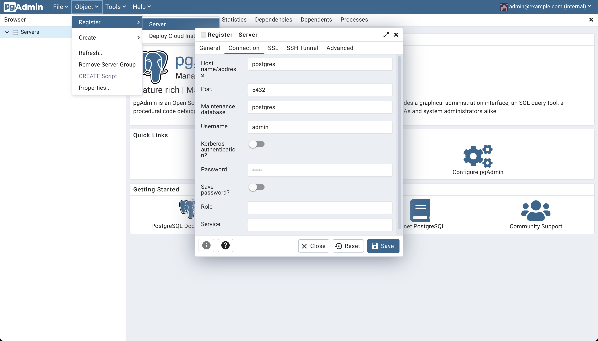

<div>
  <h1 align="center">docker-postgres-pgadmin</h1>
  <h4 align="center">Quick setup to run PostgreSQL + PgAdmin in a Docker instance</h4>
</div>

## Usage

1. Fork and Clone this Repository

```bash
git clone https://github.com/EstebanBorai/docker-postgres-pgadmin.git
```

> Forking is optional, but you might want to do some changes and commit them.

2. Step into directory files

```bash
cd ./docker-postgres-pgadmin
```

3. Run `docker compose` to spin up containers

```bash
docker compose up
```

4. When containers are ready, visit `http://localhost:5050/` and provide
credentials as configured on `.env`.

Default credentials are:

```
admin@example.com
admin
```

5. Then create a connection to the PostgreSQL instance in the container as
follows:

<div align="center">
  
</div>
